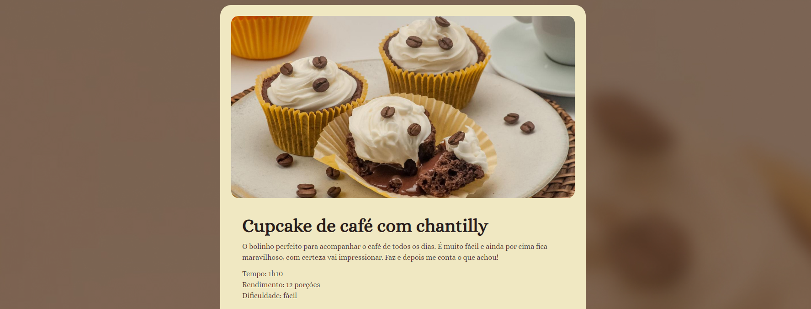

<!--- # "Can be a image or a gift from the project pages" -->

  

# Recipe Page

This project is to learn HTML and CSS.

## Tech Stack

<!--- # "Verify icons availability here https://github.com/tandpfun/skill-icons" -->

## Getting Started

1. **Install Dependencies**: `npm install or yarn`
2. **Create containers**: `docker-compose up -d`
3. **Environment variables**: Copy `.env.example` to a new `.env.local`
4. **Database Setup**: `npx prisma migrate dev --name init`
5. **Start Developing**: `npm run start:dev (api) & npm run dev (frontend)`

## Contribute

1. **Clone project**: `git clone https://github.com/Fernanda-Kipper/Readme-Templates.git`
2. **Create feature/branch**: `git checkout -b feature/NAME`

## License

This software is available under the following licenses:

- [MIT](https://rem.mit-license.org)
